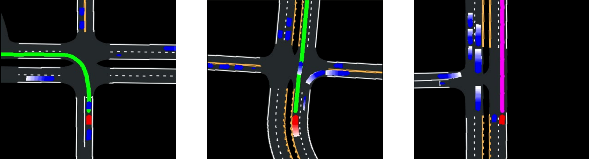
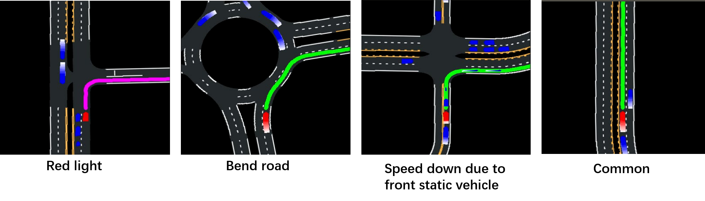
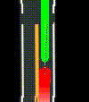
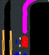
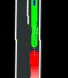
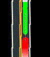
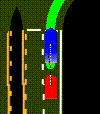
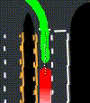

# Future Trajectory Prediction with Deep Imitation Learning

## Dataset

CARLA simulator provides a model-based motion controller, which is used to act as expert driver. During simulation, states of both ego and surrounding vehicles, traffic light, as well as HD map are recorded.  

### Rendered Image

Modify [the CARLA official visualizer example](https://github.com/carla-simulator/carla/blob/master/PythonAPI/examples/no_rendering_mode.py) to generate map and record actors' information

- Simplify its map representation by removing: 

  ```
  "STOP" and arrow mark
  parking, shoulder and sidewalk areas
  ```

- develop a route planner based on road topology and future positions


The final rendered images are shown as below:



```
Image size: 384 * 384
Actual resolution: 0.2 meter/pixel
Field view: 76.8 * 76.8 meters
Record frequency: 10 Hz
```

| Including Information                  | Comment                                                      |
| -------------------------------------- | ------------------------------------------------------------ |
| HD Map                                 |                                                              |
| Routing                                | When traffic light become red, routing turn to purple, otherwise green |
| Historical ego state                   | Render in red and reduce brightness with earlier time step   |
| Historical surrounding vehicles' state | Render in green and reduce brightness with earlier time step |

### Scene Classification

In order to balance data, classify as following four typical scenes:



| Dataset    | Number                              |
| ---------- | ----------------------------------- |
| Training   | 59,392 frames (14,848 per scene)    |
| Validation | 4,960 frames of a continuous video  |
| Testing    | 10,000 frames of a continuous video |

## VGG-based Network

Use **VGGNet-16** as base network and output the **position (x, y)** of each time step in image coordinate.

**Loss function** is simply mean square error:

<p align="center">

</p>

**Training process**:


```
- Train with Adam optimizer
- Learning rate is scheduled to be reduced by 10 times after 10, 20, 30, 40 epochs with initial value of 0.001
```

**Evaluation**: 

Set Time step = 20, namely predict trajectory of two seconds

| Dataset             | Training      | Validation    | Testing                           |
| ------------------- | ------------- | ------------- | --------------------------------- |
| mean absolute error | 1.1708 pixels | 1.8959 pixels | 1.75 pixels, equivalent to 0.35 m |

### Failure Case

**Tips**: 

- Zoom in the resulting image for better visualization 
- white points denote ground truth and black points are predicted trajectory

**Summary:**

1. The more straight the road is, the more accurate the prediction is.

<p align="center">


</p>

2. Does not know when the traffic light will turn to red

<p align="center">

</p>

3. Cannot speed down and up in time 

<p align="center">
				

</p>

4. Does not learn to stop for a while in front of "STOP" sign (represented by a cross-bar on map)

<p align="center">
				

</p>

## Other Network

Simply replace the base network with ResNet-50-v2 and MobileNet-v2

**Evaluation**: 

Comparison 

|              | Training | Validation | Testing         |
| ------------ | -------- | ---------- | --------------- |
| VGG-16       | 1.1708   | 1.8959     | 1.75 (=0.350 m) |
| ResNet-50-v2 | 0.5587   | 1.2561     | 1.14 (=0.228 m) |
| MobileNet-v2 | 0.6988   | 1.6717     | 1.42 (=0.284 m) |

# Requirement

> Python 3.6
>
> tensorflow 1.12.3
>
> opencv-python 3.4.5.20

# TODO

- [x] Generate dataset with CARLA simulator
- [x] One rendered image --> CNN --> Fully connected layers --> Future Trajectory
  - [x] VGG-16 architecture
  - [x] ResNet-50 architecture
- [ ] Separate the input information which can avoid overlapping problem
  - HD Map (M)
  - Surrounding vehicles' state (S)
  - Ego state (E)
  - Routing (R)
- [ ] Trained with continuous frames (every one second) 
- [ ] Input images --> CNN --> Parametric probability distribution (Mixed Gaussian Model)

<p align="center">

</p>

Loss is to minimize the negative log-likelihood of the ground truth future locations under the predicted trajectory according to a GMM with parameters

- [ ] Try to output probabilistic grid map

  explicit theory need to be stated ...


# Reference

[1] Chen, J., Yuan, B. and Tomizuka, M., 2019. Deep Imitation Learning for Autonomous Driving in Generic Urban Scenarios with Enhanced Safety. *arXiv preprint arXiv:1903.00640*.

[2] Amini, A., Rosman, G., Karaman, S. and Rus, D., 2019, May. Variational end-to-end navigation and localization. In *2019 International Conference on Robotics and Automation (ICRA)*(pp. 8958-8964). IEEE.

[3] Hong, J., Sapp, B. and Philbin, J., 2019. Rules of the Road: Predicting Driving Behavior with a Convolutional Model of Semantic Interactions. In *Proceedings of the IEEE Conference on Computer Vision and Pattern Recognition* (pp. 8454-8462).