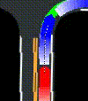

# Future Trajectory Prediction with Deep Imitation Learning


## Rendered Image

Modify [the CARLA official visualizer example](https://github.com/carla-simulator/carla/blob/master/PythonAPI/examples/no_rendering_mode.py) to generate dataset

- Simplify its map representation by removing: 

  ```
  "STOP" and arrow mark
  parking, shoulder and sidewalk areas
  ```

- develop a route planner based on road topology and future positions


The final rendered images are shown as below:


```
Image size: 384 * 384
Actual resolution: 0.2 meter/pixel
Field view: 76.8 * 76.8 meters
Record frequency: 10 Hz
```

| Including Information                  | Comment                                                      |
| -------------------------------------- | ------------------------------------------------------------ |
| HD Map                                 |                                                              |
| Routing                                | When traffic light become red, routing turn to purple, otherwise green |
| Historical ego state                   | Render in red and reduce brightness with earlier time step   |
| Historical surrounding vehicles' state | Render in green and reduce brightness with earlier time step |

## Dataset

In order to balance data, classify as following four typical scenes:


| Dataset    | Number                              |
| ---------- | ----------------------------------- |
| Training   | 59,392 frames (14,848 per scene)    |
| Validation | 4,960 frames of a continuous video  |
| Testing    | 10,000 frames of a continuous video |

## VGG-based Network

Use **VGGNet-16** as base network and output the **position (x, y)** of each time step in image coordinate.

**Loss function** is simply mean square error:

^2&space;&plus;&space;(y_{t&plus;i}-\hat{y}_{t&plus;i})^2})

**Training process**:


```
- Train with Adam optimizer
- Learning rate is scheduled to be reduced by 10 times after 10, 20, 30, 40 epochs with initial value of 0.001
```

**Evaluation**: 

Set Time step = 20, namely predict trajectory of two seconds

| Dataset             | Training      | Validation    | Testing                           |
| ------------------- | ------------- | ------------- | --------------------------------- |
| mean absolute error | 1.1708 pixels | 1.8959 pixels | 1.75 pixels, equivalent to 0.35 m |

### Existing Limitation

**Tips**: 

- Zoom in the resulting image for better visualization 
- white points denote ground truth and black points are predicted trajectory

**Summary:**

1. The more straight the road is, the more accurate the prediction is.

   				

2. Does not know when the traffic light will turn to red
   
   

3. Cannot speed down and up in time 

   				

4. Does not learn to stop for a while in front of "STOP" sign (represented by a cross-bar on map)

   				


## ResNet-based Network


## TODO

- [x] Generate dataset with CARLA simulator
- [x] One rendered image --> CNN --> Fully connected layers --> Future Trajectory
  - [x] VGG-16 architecture
  - [x] ResNet-50 architecture
- [ ] Separate the input information which can avoid overlapping problem
  - HD Map (M)
- Surrounding vehicles' state (S)
  - Ego state (E)
- Routing (R)
- [ ] Trained with continuous frames (every one second) 
- [ ] Input images --> CNN --> Parametric probability distribution (Mixed Gaussian Model)

&space;=&space;\sum{\phi_i&space;\mathcal{N}(\mu_i,&space;\sigma_i^2)})

  Loss is to minimize the negative log-likelihood of the ground truth future locations under the predicted trajectory according to a GMM with parameters 

- [ ] Try to output probabilistic grid map

  explicit theory need to be stated ...